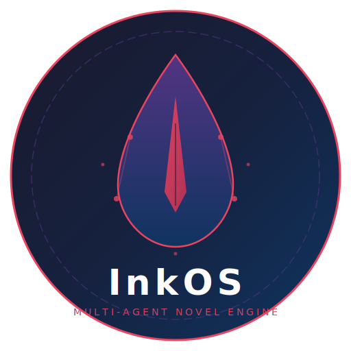

<p align="center">
  
</p>

<h1 align="center">InkOS</h1>

<p align="center">
  <strong>Multi-Agent Novel Production System</strong><br>
  <strong>多智能体网文生产系统</strong>
</p>

<p align="center">
  <a href="LICENSE"></a>
  <a href="https://nodejs.org/"></a>
  <a href="https://pnpm.io/"></a>
  <a href="https://github.com/Narcooo/inkos/actions"></a>
  <a href="#status"></a>
  <a href="https://www.typescriptlang.org/"></a>
</p>

<p align="center">
  <a href="#why-inkos">English</a> | <a href="#为什么选择-inkos">中文</a>
</p>

---

Open-source multi-agent novel production system. AI agents autonomously write, audit, and revise novels — with human review gates that keep you in control.

开源多智能体网文生产系统。AI 智能体自主写作、审计、修订小说 — 人类审核门控让你始终掌控全局。

> Inspired by a validated workflow from a [linux.do](https://linux.do) community member who earned $10K+ in 3 months using AI-assisted novel writing.
>
> 灵感来自 [linux.do](https://linux.do) 社区成员验证的工作流，该成员通过 AI 辅助网文写作在 3 个月内收入超过 $10K。

---

## Why InkOS?

Writing a novel with AI isn't just "prompt and paste." Long-form fiction breaks down fast: characters forget things, items appear from nowhere, the same adjectives repeat every paragraph, and plot threads silently die. InkOS treats these as engineering problems.

- **Canonical truth files** — track the real state of the world, not what the LLM hallucinates
- **Anti-information-leaking** — ensures characters only know what they've actually witnessed
- **Resource decay** — supplies deplete and items break, no infinite backpacks
- **Vocabulary fatigue detection** — catches overused words before your readers do
- **Auto-revision** — fixes critical issues (math errors, continuity breaks) before they reach human review

## 为什么选择 InkOS？

用 AI 写小说不是简单的"提示词+复制粘贴"。长篇小说很快就会崩：角色记忆混乱、物品凭空出现、同样的形容词每段都在重复、伏笔悄无声息地断了。InkOS 把这些当工程问题来解决。

- **三大真相文件** — 追踪世界的真实状态，而非 LLM 的幻觉
- **反信息泄漏** — 确保角色只知道他们亲眼见证过的事
- **资源衰减** — 物资会消耗、物品会损坏，没有无限背包
- **词汇疲劳检测** — 在读者发现之前就捕捉过度使用的词语
- **自动修订** — 在人工审核之前修复关键问题（数值错误、连续性断裂）

---

## How It Works / 工作原理

InkOS runs a multi-agent pipeline for each chapter:

```
 Radar ──> Architect ──> Writer ──> Continuity Auditor ──> Reviser
   │           │           │               │                   │
 Scans      Plans       Drafts         Audits the          Fixes issues
 trending   chapter     prose from      draft against       flagged by
 topics     outline     the outline     canonical truth     the auditor
```

### Agent Roles / 智能体角色

| Agent 智能体 | Responsibility 职责 |
|-------|---------------|
| **Radar** 雷达 | Scans platform trends and reader preferences / 扫描平台趋势和读者偏好 |
| **Architect** 建筑师 | Plans chapter structure: outline, scene beats, pacing / 规划章节结构：大纲、场景节拍、节奏 |
| **Writer** 写手 | Produces prose from the plan + current world state / 根据大纲+当前世界状态生成正文 |
| **Continuity Auditor** 连续性审计员 | Validates draft against canonical truth files / 对照真相文件验证草稿 |
| **Reviser** 修订者 | Fixes issues found by auditor / 修复审计发现的问题 |

### Three Canonical Truth Files / 三大真相文件

Every book maintains three files as the single source of truth:

每本书维护三个文件作为唯一事实来源：

| File 文件 | Purpose 用途 |
|------|---------|
| `current_state.md` | World state: locations, relationships, knowledge, emotions / 世界状态：位置、关系、认知、情感 |
| `particle_ledger.md` | Resource accounting: items, money, quantities, decay / 资源账本：物品、金钱、数量、衰减 |
| `pending_hooks.md` | Open plot threads: foreshadowing, promises, conflicts / 未闭合伏笔：铺垫、承诺、冲突 |

The Continuity Auditor checks every draft against these files. If a character "remembers" something they never witnessed, or pulls a weapon they lost two chapters ago, the auditor catches it.

连续性审计员对照这三个文件检查每一章草稿。如果角色"记起"了他们从未亲眼见过的事，或者拿出了两章前已经丢失的武器，审计员会捕捉到。

---

## Architecture / 项目结构

```
inkos/
├── packages/
│   ├── core/              # Agent runtime, pipeline, state / 智能体运行时、管线、状态
│   │   ├── agents/        # architect, writer, continuity, reviser, radar
│   │   ├── pipeline/      # runner (write→audit→revise), scheduler (daemon)
│   │   ├── state/         # File-based state manager / 基于文件的状态管理
│   │   ├── llm/           # OpenAI-compatible provider (streaming)
│   │   ├── notify/        # Telegram, Feishu (飞书), WeCom (企业微信)
│   │   ├── models/        # Zod schemas
│   │   └── prompts/       # Agent prompt templates / 提示词模板
│   └── cli/               # Commander.js CLI
│       └── commands/      # init, book, write, review, status, radar, daemon, doctor
├── templates/             # Project scaffolding templates / 项目脚手架模板
└── (future) studio/       # Web UI / 网页界面
```

TypeScript monorepo managed with pnpm workspaces.

---

## Quick Start / 快速开始

### Prerequisites / 前置要求

- Node.js >= 20.0.0
- pnpm >= 9.0.0
- An OpenAI-compatible API key / 一个 OpenAI 兼容的 API Key

### Install / 安装

```bash
git clone https://github.com/Narcooo/inkos.git
cd inkos
pnpm install
pnpm build
```

### Configure / 配置

```bash
cp .env.example .env
```

```env
# .env
OPENAI_API_KEY=sk-your-key-here
OPENAI_BASE_URL=https://api.openai.com/v1   # or any compatible endpoint
OPENAI_MODEL=gpt-4o

# Optional: notifications / 可选：通知
TELEGRAM_BOT_TOKEN=
TELEGRAM_CHAT_ID=
FEISHU_WEBHOOK_URL=
WECOM_WEBHOOK_URL=
```

### Create Your First Book / 创建你的第一本书

```bash
# Initialize project / 初始化项目
inkos init

# Create a new book / 创建新书（交互式）
inkos book create

# Write the next chapter / 写下一章（运行完整智能体管线）
inkos write next

# Review the latest draft / 审阅最新草稿
inkos review

# Check project status / 查看项目状态
inkos status
```

---

## CLI Reference / 命令参考

| Command 命令 | Description 说明 |
|---------|-------------|
| `inkos init` | Initialize project / 初始化项目 |
| `inkos book create` | Create a new book (interactive) / 创建新书 |
| `inkos write next` | Run agent pipeline for next chapter / 智能体管线写下一章 |
| `inkos write rewrite <n>` | Rewrite chapter N (restores state snapshot) / 重写第 N 章 |
| `inkos review` | Review and approve/reject draft / 审阅草稿 |
| `inkos review approve-all <id>` | Batch approve all pending chapters / 批量通过所有待审章节 |
| `inkos status` | Show project and book status / 项目状态 |
| `inkos export <id>` | Export book to txt/md / 导出书籍 |
| `inkos radar` | Scan platform trends / 扫描平台趋势 |
| `inkos config` | View/update configuration / 查看/更新配置 |
| `inkos doctor` | Diagnose setup issues / 诊断配置问题 |
| `inkos up` | Start daemon mode / 启动守护进程 |
| `inkos down` | Stop daemon / 停止守护进程 |

---

## Key Features / 核心特性

### State Snapshots / 状态快照

Every chapter automatically creates a state snapshot. Use `inkos write rewrite <n>` to roll back and regenerate any chapter — world state, resource ledger, and plot hooks all restore to the pre-chapter state.

每章自动创建状态快照。使用 `inkos write rewrite <n>` 可以回滚并重新生成任意章节 — 世界状态、资源账本、伏笔钩子全部恢复到该章写入前的状态。

### Write Lock / 写入锁

File-based locking prevents concurrent writes to the same book — no more duplicate chapters from parallel processes.

基于文件的锁机制防止对同一本书的并发写入 — 不再出现并行进程产生重复章节的问题。

### Daemon Mode / 守护进程模式

`inkos up` starts an autonomous loop that writes chapters on a schedule. The pipeline runs fully unattended for non-critical issues, but pauses for human review when the auditor flags problems it cannot auto-fix.

`inkos up` 启动自主循环，按计划写章。管线对非关键问题全自动运行，但当审计员标记无法自动修复的问题时会暂停等待人工审核。

Notifications via Telegram, Feishu (飞书), or WeCom (企业微信).

通过 Telegram、飞书或企业微信发送通知。

---

## Status / 项目状态

**Early alpha / 早期 alpha 阶段。** The core pipeline works, but expect breaking changes.

核心管线可用，但预计会有破坏性变更。

What works / 已实现：
- Full agent pipeline (architect → writer → continuity auditor → reviser) / 完整智能体管线
- File-based state management with canonical truth files / 基于文件的状态管理 + 真相文件
- CLI for project init, book creation, writing, review, export / 完整 CLI
- State snapshots and chapter rewrite / 状态快照和章节重写
- Notification dispatch (Telegram, Feishu, WeCom) / 通知推送
- Daemon mode with scheduler / 守护进程模式
- 102 unit tests / 102 个单元测试

What's planned / 规划中：
- `packages/studio` — web UI for review and editing / 网页审阅编辑界面
- Plugin system for custom agents / 自定义智能体插件系统
- Multi-LLM routing (different models for different agents) / 多模型路由
- Export to platform-specific formats (起点, 番茄, etc.) / 平台格式导出

---

## Contributing / 贡献

Contributions welcome. This is early-stage software — if you're interested in AI-assisted creative writing infrastructure, open an issue or PR.

欢迎贡献。这是早期阶段的软件 — 如果你对 AI 辅助创作基础设施感兴趣，欢迎提 issue 或 PR。

```bash
pnpm install
pnpm dev          # watch mode / 监听模式
pnpm test         # run tests / 运行测试
pnpm typecheck    # type-check / 类型检查
```

---

## License

[MIT](LICENSE)
